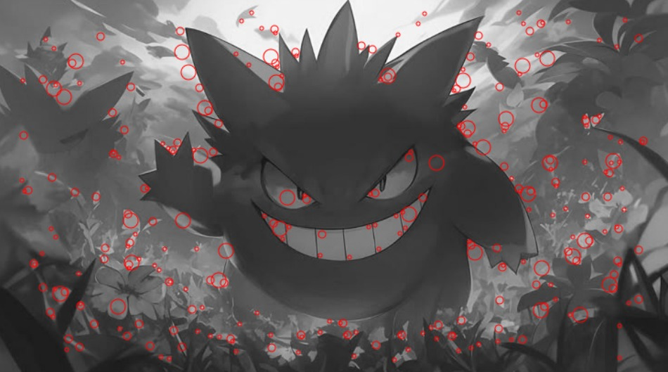

# Introducción

Este documento describe la estructura y el funcionamiento de la Hoja de Trabajo No. 2. A continuación, se detallan las secciones de HTML, imagen de prueba, imagen compilada y funcionamiento.

# HTML

La estructura HTML del proyecto se organiza de la siguiente manera:

```html
<!DOCTYPE html>
<html lang="es">
<head>
    <meta charset="UTF-8">
    <meta name="viewport" content="width=device-width, initial-scale=1.0">
    <title>HT2 - Oscar Eduardo Morales Giron 201603028 - MindAR</title>
    <script src="https://aframe.io/releases/1.5.0/aframe.min.js"></script>
    <script src="https://cdn.jsdelivr.net/npm/mind-ar@1.2.5/dist/mindar-image-aframe.prod.js"></script>
</head>
<body style="margin: 0px; overflow: hidden;">
    <a-scene mindar-image="imageTargetSrc: ./assets/targets.mind;" vr-mode-ui="enabled: false" device-orientation-permission-ui="enabled: false">
        <a-camera position="0 0 0" look-controls="enabled: false"></a-camera>
        <a-entity mindar-image-target="targetIndex: 0">
            <a-scene>
                <!-- Cuerpo principal -->
                <a-sphere position="0 1 -3" radius="0.5" color="purple"></a-sphere>
            
                <!-- Ojos -->
                <a-entity>
                    <a-ellipse position="-0.2 1.2 -2.6" width="0.15" height="0.1" rotation="0 0 10" color="red"></a-ellipse>
                    <a-ellipse position="0.2 1.2 -2.6" width="0.15" height="0.1" rotation="0 0 -10" color="red"></a-ellipse>
                </a-entity>
            
                <!-- Pupilas -->
                <a-sphere position="-0.22 1.2 -2.55" radius="0.03" color="black"></a-sphere>
                <a-sphere position="0.22 1.2 -2.55" radius="0.03" color="black"></a-sphere>
            
                <!-- Boca -->
                <a-entity>
                    <a-box position="0 0.85 -2.5" width="0.3" height="0.1" depth="0.01" color="black"></a-box>
                    <a-box position="0 0.79 -2.49" width="0.3" height="0.05" depth="0.01" color="white"></a-box>
                </a-entity>
            
                <!-- Púas -->
                <a-cone position="-0.2 1.6 -3" radius-bottom="0.15" radius-top="0.02" height="0.25" color="purple"></a-cone>
                <a-cone position="0 1.65 -3" radius-bottom="0.2" radius-top="0.02" height="0.3" color="purple"></a-cone>
                <a-cone position="0.2 1.6 -3" radius-bottom="0.15" radius-top="0.02" height="0.25" color="purple"></a-cone>
            
                <!-- Brazos -->
                <a-cylinder position="-0.5 1 -3" radius="0.1" height="0.2" rotation="0 0 20" color="purple"></a-cylinder>
                <a-cylinder position="0.5 1 -3" radius="0.1" height="0.2" rotation="0 0 -20" color="purple"></a-cylinder>
            
                <!-- Manos -->
                <a-sphere position="-0.6 0.95 -3" radius="0.08" color="purple"></a-sphere>
                <a-sphere position="0.6 0.95 -3" radius="0.08" color="purple"></a-sphere>
            
                <!-- Piernas -->
                <a-cylinder position="-0.2 0.7 -3" radius="0.1" height="0.15" color="purple"></a-cylinder>
                <a-cylinder position="0.2 0.7 -3" radius="0.1" height="0.15" color="purple"></a-cylinder>
            </a-scene>
        </a-entity>
    </a-scene>
</body>
</html>
```

# Imagen de Prueba

A continuación, se muestra la imagen utilizada para la prueba.


# Imagen Compilada

Aquí se presenta la imagen compilada generada para la práctica:



# Funcionamiento

El funcionamiento de la práctica es simple, ya que no se instalaron librerías adicionales y todo el procesamiento de MindAR se realiza desde el código HTML mediante la importación correspondiente. El código permite visualizar la imagen de prueba a través de la cámara, analizarla y mostrar un objeto 3D en la posición de la imagen.


