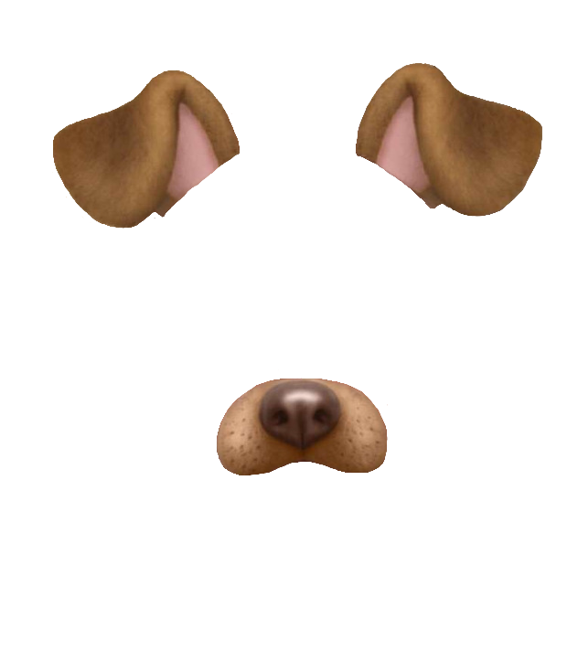
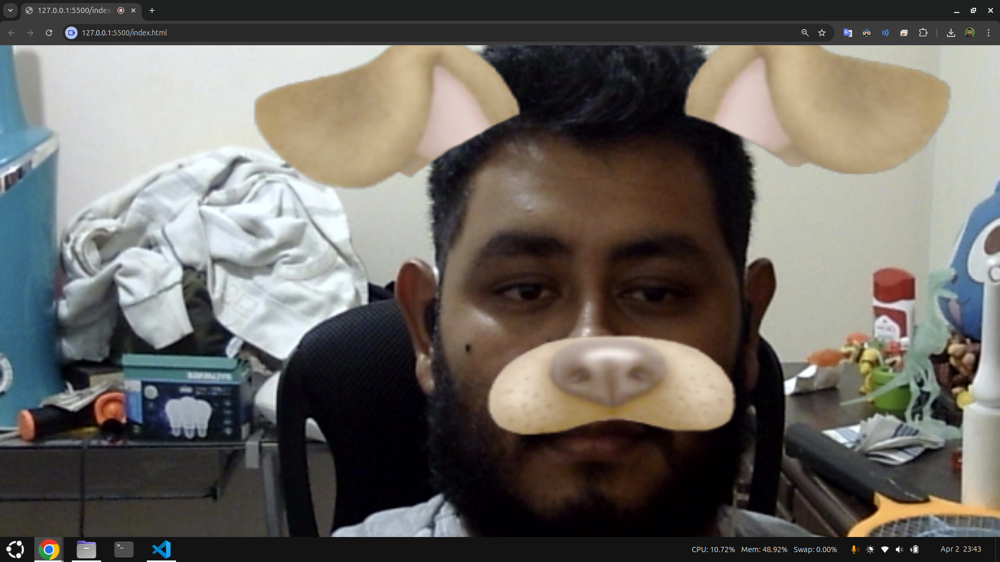
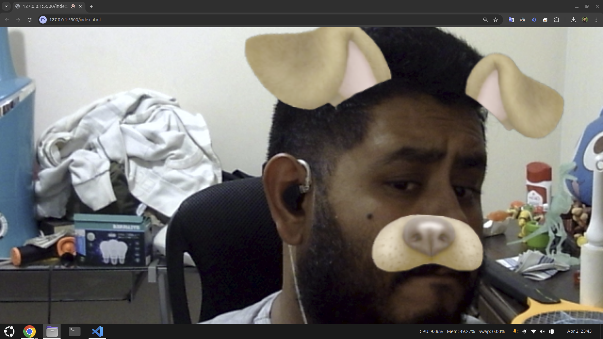

# Introducción

Se utiliza la biblioteca MindAR para implementar un filtro de realidad aumentada que se superpone a la cara del usuario. El objetivo es demostrar cómo se puede integrar un filtro 2D en un entorno web utilizando HTML sin necesidad de instalar librerías adicionales.

# Filtro a aplicar

El filtro aplicado son unas orejas y nariz de perro, que se coloca en la posición de la cara del usuario. La imagen utilizada es la siguiente:

Este filtro se carga como una textura en un objeto 2D y se posiciona dinámicamente en la escena de realidad aumentada.

# Funcionamiento

El funcionamiento de la práctica es sencillo, ya que no se necesitan instalar librerías adicionales; todo el funcionamiento de MindAR se activa directamente desde HTML mediante la importación correspondiente. El código muestra la imagen capturada por la cámara, la analiza y luego coloca un objeto 2D en la posición detectada en la imagen.

El proceso incluye los siguientes pasos:
1. Configuración de la escena de realidad aumentada utilizando MindAR y Three.js
2. Carga de la textura del filtro y su asignación a un objeto 2D
3. Posicionamiento dinámico del filtro en la cara detectada
4. Renderizado continuo de la escena para mantener el filtro alineado con la cara.

A continuación, se muestran capturas del funcionamiento:

